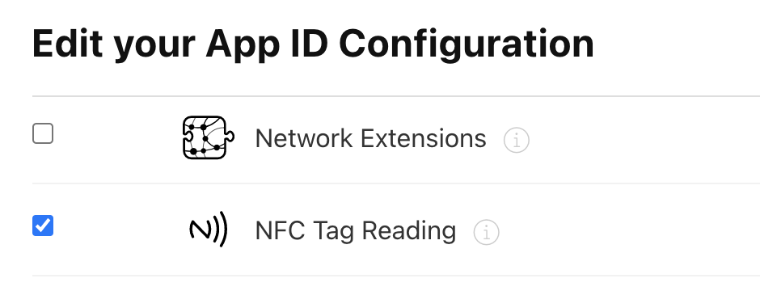
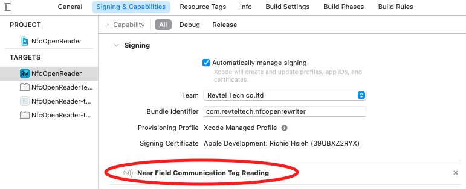
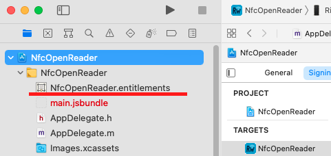
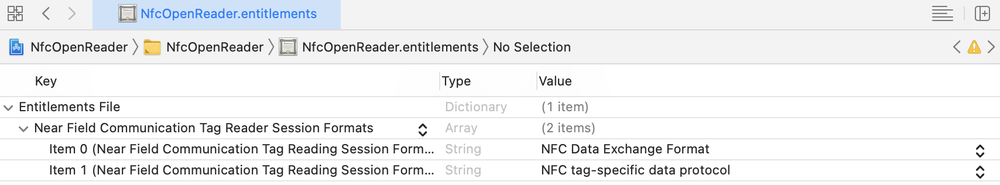

# react-native-nfc-manager

[](https://www.npmjs.com/package/react-native-nfc-manager)
[](https://travis-ci.org/whitedogg13/react-native-nfc-manager)
[](https://github.com/whitedogg13/react-native-nfc-manager/issues)

Bring NFC feature to React Native. Inspired by [phonegap-nfc](https://github.com/chariotsolutions/phonegap-nfc) and [react-native-ble-manager](https://github.com/innoveit/react-native-ble-manager)

Contributions are welcome!

Made with ❤️ by [whitedogg13](https://github.com/whitedogg13) and [revteltech](https://github.com/revtel)

> Special thanks to [javix64](https://github.com/javix64) for restructuring the documentation!

## Table of Contents

1. [Installation](#installation)
2. [Getting Started](#gettingstarted)
3. [Setup](#setup)
4. [Documentation](#docs)
5. [Nfc compatibility](#nfccompatibility)
6. [Usage Concept](#usageconcept)
7. [API](#api)
8. [App demo](#appdemo)
9. [Learn](#learn)

## Installation

<a name="installation"></a>

```shell
npm i --save react-native-nfc-manager
```
### iOS

This library use native-modules, so you will need to do `pod install` for iOS:

```shell
cd ios && pod install && cd ..
```
### Android

It should be properly auto-linked, so you don't need to do anything.

## Setup

<a name="setup"></a>

### iOS

1. In [apple developer site](https://developer.apple.com/), enable capability for NFC



2. in Xcode, add `NFCReaderUsageDescription` into your `info.plist`, for example:

```
<key>NFCReaderUsageDescription</key>
<string>We need to use NFC</string>
```

More info on Apple's [doc](https://developer.apple.com/documentation/bundleresources/information_property_list/nfcreaderusagedescription?language=objc)

Additionally, if writing ISO7816 tags add application identifiers (aid) into your `info.plist` as needed like this.
```
<key>com.apple.developer.nfc.readersession.iso7816.select-identifiers</key>
<array>
  <string>D2760000850100</string>
  <string>D2760000850101</string>
</array>
```

More info on Apple's [doc](https://developer.apple.com/documentation/corenfc/nfciso7816tag)

**Note:** If you are using `NfcTech.FelicaIOS`, you must also add the following code to your `Info.plist` file, otherwise the library will crash:

```xml
<key>com.apple.developer.nfc.readersession.felica.systemcodes</key>
<array>
  <string>8005</string>
  <string>8008</string>
  <string>0003</string>
  <string>fe00</string>
  <string>90b7</string>
  <string>927a</string>
  <string>12FC</string>
  <string>86a7</string>
</array>
```

An incomplete list of aid's can be found here. [Application identifier](https://www.eftlab.com/knowledge-base/211-emv-aid-rid-pix/)

3. in Xcode's `Signing & Capabilities` tab, make sure `Near Field Communication Tag Reading` capability had been added, like this:



If this is the first time you toggle the capabilities, the Xcode will generate a `<your-project>.entitlement` file for you:



4. in Xcode, review the generated entitlement. It should look like this:



More info on Apple's [doc](https://developer.apple.com/documentation/bundleresources/entitlements/com_apple_developer_nfc_readersession_formats?language=objc)

### Android

Simple add `uses-permission` into your `AndroidManifest.xml`:

```xml
 <uses-permission android:name="android.permission.NFC" />
```

#### **Support Android 12**

We start to support Android 12 from `v3.11.1`, and you will need to update `compileSdkVersion` to `31`, otherwise the build will fail:

```
buildscript {
    ext {
        ...
        compileSdkVersion = 31
        ...
    }
    ...
}
```

The reason for this is because Android puts new limitation on [PendingIntent](https://developer.android.com/reference/android/app/PendingIntent#FLAG_MUTABLE) which says `Starting with Build.VERSION_CODES.S, it will be required to explicitly specify the mutability of PendingIntents`

> The original issue is [here](https://github.com/revtel/react-native-nfc-manager/issues/469)

If you don't care about **Android 12** for now, you can use **`v3.11.0`** as a short term solution.


## Getting Started

<a name="gettingstarted"></a>

The simplest (and most common) use case for this library is to read `NFC` tags containing `NDEF`, which can be achieved via the following codes:

```javascript
import React from 'react';
import {View, Text, TouchableOpacity, StyleSheet} from 'react-native';
import NfcManager, {NfcTech} from 'react-native-nfc-manager';

// Pre-step, call this before any NFC operations
NfcManager.start();

function App() {
  async function readNdef() {
    try {
      // register for the NFC tag with NDEF in it
      await NfcManager.requestTechnology(NfcTech.Ndef);
      // the resolved tag object will contain `ndefMessage` property
      const tag = await NfcManager.getTag();
      console.warn('Tag found', tag);
    } catch (ex) {
      console.warn('Oops!', ex);
    } finally {
      // stop the nfc scanning
      NfcManager.cancelTechnologyRequest();
    }
  }

  return (
    <View style={styles.wrapper}>
      <TouchableOpacity onPress={readNdef}>
        <Text>Scan a Tag</Text>
      </TouchableOpacity>
    </View>
  );
}

const styles = StyleSheet.create({
  wrapper: {
    flex: 1,
    justifyContent: 'center',
    alignItems: 'center',
  },
});

export default App;
```


## DOCUMENTATION

<a name="docs"></a>

Check the full documentation that contains `examples`, `faq` and other topics like `Expo` in our [Wiki](https://github.com/revtel/react-native-nfc-manager/wiki)

## Nfc Compatibility

<a name="nfccompatibility"></a>

|NFC Technologies   | Android | iOS  |
|---                |---      |---   |
| `Ndef`            | ✅      | ✅   |
| `NfcA`            | ✅      | ✅   |
| `IsoDep`          | ✅      | ✅   |
| `NfcB`            | ✅      | ❌   |
| `NfcF`            | ✅      | ❌   |
| `NfcV`            | ✅      | ❌   |
| `MifareClassic`   | ✅      | ❌   |
| `MifareUltralight`| ✅      | ❌   |
| `MifareIOS`       | ❌      | ✅   |
| `Iso15693IOS`     | ❌      | ✅   |
| `FelicaIOS`       | ❌      | ✅   |

## Usage concept

<a name="usageconcept"></a>

In higher level, there're 4 steps to use this library:

0. (Recommended but not necessary) Before all next steps, use `NfcManager.start()` to start listen a tag.


1. Request your particular NFC technologies through `NfcManager.requestTechnology`. Let's request `Ndef` techonogy.

```javascript
NfcManager.requestTechnology(NfcTech.Ndef);
```

2. Select the proper NFC technology handler, which is implemented as getter in main `NfcManager` object.

```javascript
NfcManager.ndefHandler
```

3. Call specific methods on the NFC technology handler.

```javascript
NfcManager.ndefHandler.getNdefMessage()
```

4. Clean up your tech registration through:

```javascript
NfcManager.cancelTechnologyRequest()
```


## API

<a name="api"></a>

The following table shows the handler for each technology, so if you need to use a technology, go to [index.d.ts](index.d.ts) and search for it.

|NFC Technologies   | Handlers |
|---                |---      |
| `Ndef`            | `NdefHandler` |
| `NfcA`            | `NfcAHandler` |
| `IsoDep`          | `IsoDepHandler` |
| `NfcB`            | - |
| `NfcF`            | - |
| `NfcV`            | `NfcVHandler` |
| `MifareClassic`   | `MifareClassicHandlerAndroid` |
| `MifareUltralight`| `MifareUltralightHandlerAndroid` |
| `MifareIOS`       | - |
| `Iso15693IOS`     | `Iso15693HandlerIOS` |
| `FelicaIOS`       | - |


## App Demo - NfcOpenReWriter

<a name="appdemo"></a>

We have a full featured NFC utility app using this library available for download. The source code is here: [**React Native NFC ReWriter App**](https://github.com/revtel/react-native-nfc-rewriter)

<a href='https://apps.apple.com/tw/app/nfc-rewriter/id1551243964' target='_blank'>

</a>

</br>

<a href='https://play.google.com/store/apps/details?id=com.washow.nfcopenrewriter' target='_blank'>

</a>

## Learn

<a name="learn"></a>

We have published a React Native NFC course with [newline.co](https://www.newline.co/), check it out!
- Free course (1 hour) about basic NFC setup and concept [here](https://www.youtube.com/watch?v=rAS-DvNUFck)
- Full course (3 hours) for more (NDEF, Deep Linking, NTAG password protection, signature with UID) [here](https://www.newline.co/courses/newline-guide-to-nfcs-with-react-native)

