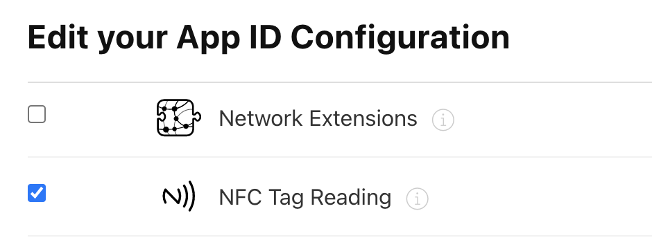
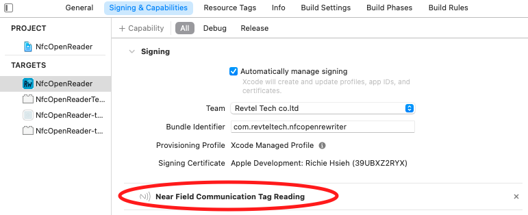
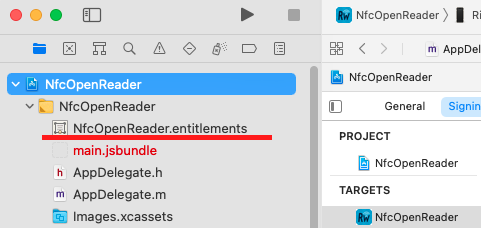
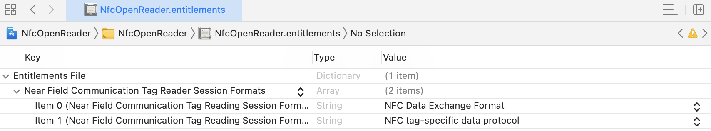

# iOS setup

For React Native CLI apps, install Pods after installing the package:

```sh
cd ios
pod install
```

The native sources require Swift 5.7 or newer. For Expo apps, follow the [config-plugin setup](./expo.md); use this page when inspecting generated native configuration.

## Enable NFC

Enable NFC for your App ID on the [Apple Developer website](https://developer.apple.com/).



## Configure Info.plist

Add `NFCReaderUsageDescription` to your `Info.plist`, for example:

```xml
<key>NFCReaderUsageDescription</key>
<string>We need to use NFC</string>
```

See the [Apple documentation](https://developer.apple.com/documentation/bundleresources/information_property_list/nfcreaderusagedescription?language=objc)

For ISO 7816 sessions, add the application identifiers (AIDs) used by your target cards. These values are application-specific; the following illustrates the configuration shape:
```xml
<key>com.apple.developer.nfc.readersession.iso7816.select-identifiers</key>
<array>
  <string>D2760000850100</string>
  <string>D2760000850101</string>
</array>
```

See the [Apple documentation](https://developer.apple.com/documentation/corenfc/nfciso7816tag)

For `NfcTech.FelicaIOS`, configure the system codes required by your target cards. The following is a configuration example; select the codes for your application:

```xml
<key>com.apple.developer.nfc.readersession.felica.systemcodes</key>
<array>
  <string>8005</string>
  <string>8008</string>
  <string>0003</string>
  <string>fe00</string>
  <string>90b7</string>
  <string>927a</string>
  <string>12FC</string>
  <string>86a7</string>
</array>
```

Use the identifiers supplied by your card or application provider.

## Signing and capabilities

In Xcode's `Signing & Capabilities` tab, add `Near Field Communication Tag Reading`:



Xcode creates an entitlements file when the capability is first added:



Review the generated entitlements. The screenshot illustrates the reader-session formats; choose the formats needed by your application:



See the [Apple documentation](https://developer.apple.com/documentation/bundleresources/entitlements/com_apple_developer_nfc_readersession_formats?language=objc)

## Entitlement configuration

Review your App ID, provisioning profile and final app entitlements together. For applications requiring only TAG reader sessions, see the [NDEF entitlement guide](../EXPO_TROUBLESHOOTING.md#ios-ndef-entitlement-and-submission-errors). NFC scans require a compatible physical iPhone and tag.
